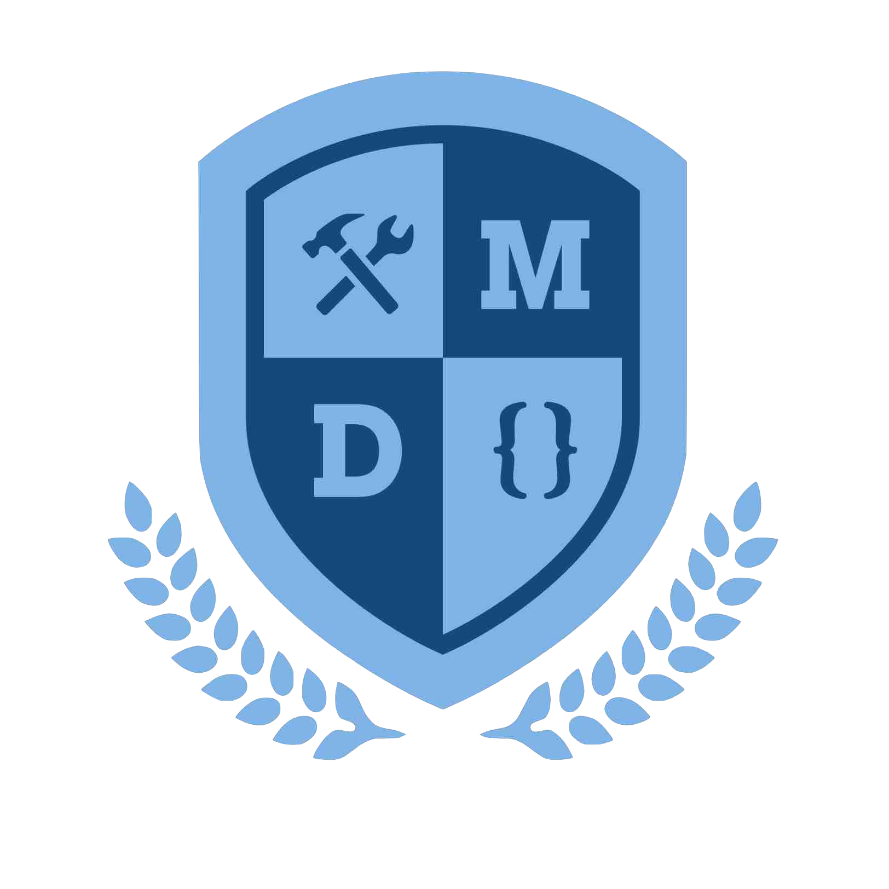
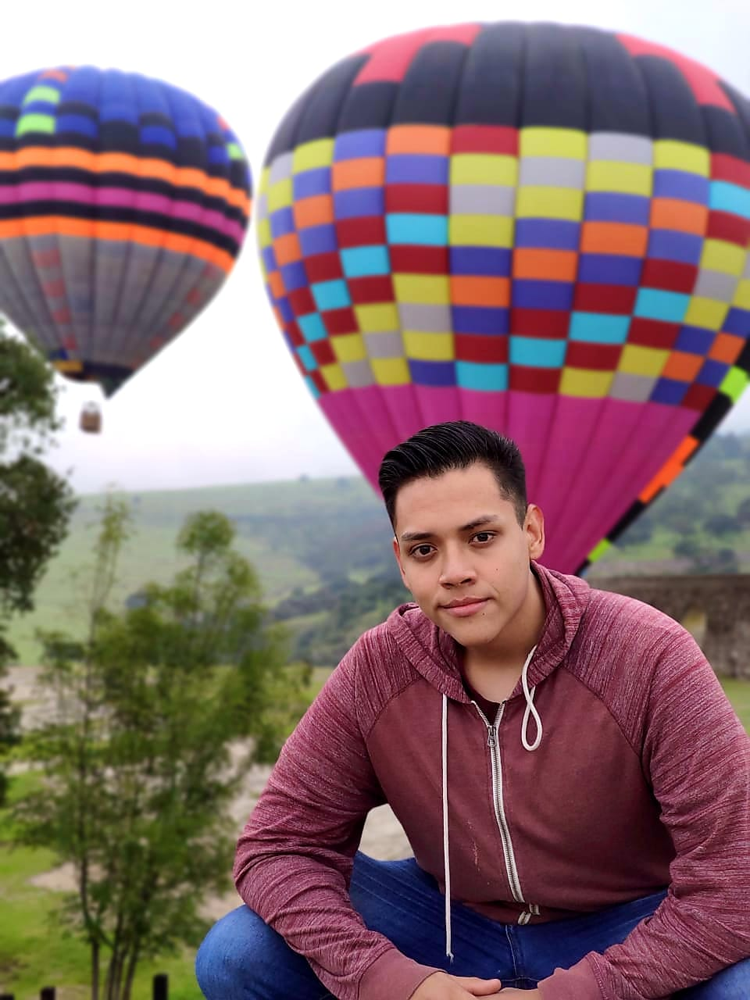

<h1 align="center">Hi, I'm Jovany Vergar, Developer Software 👾

 </img></h1>

<h2>Something about me 🐉</h2>

I am a software developer, I have learned too many things like:
- New Programming Languages
- New FrameWorks etc...

I managed to meet spectacular people, who today have taught me a lot of things,
I have instructed throughout my performance as a software developer.
I am willing to learn something new, I will always be willing to learn new technologies, 
more than help me with my performance.
Most important of all, never stop learning new technology or something that will help you in your performance.

- I love what I do 🚀
- I love learning something new 💫
- I have intermediate English 📝
- I like to design ☕
- I have been developing software for 1 year 🖥️

<h2>Where did you currently work</h2>

- I work at Making Devs, as a software developer

 
<h2>My Post 💻</h2>

<h2>Contact Us</h2>

